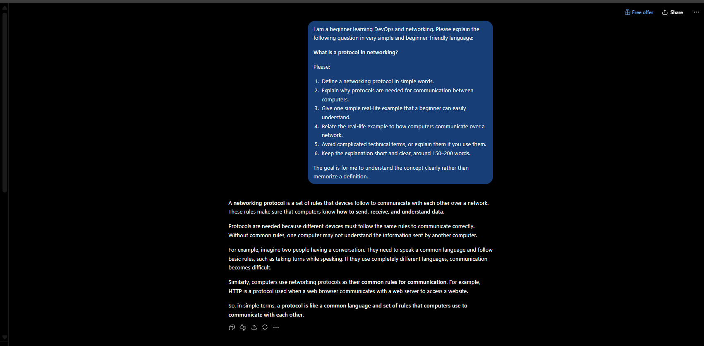
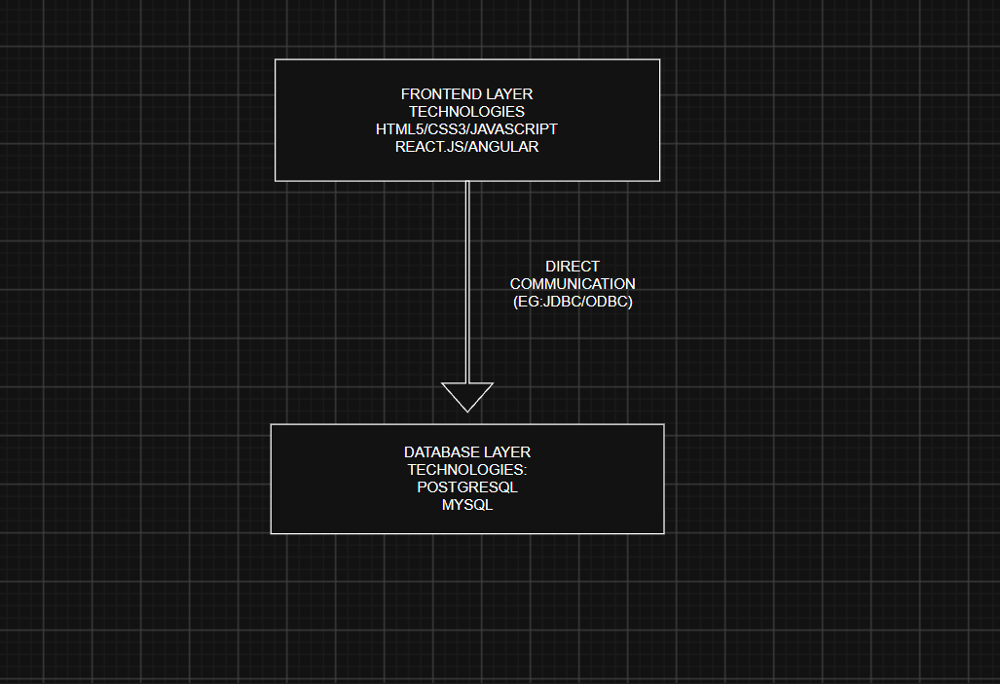
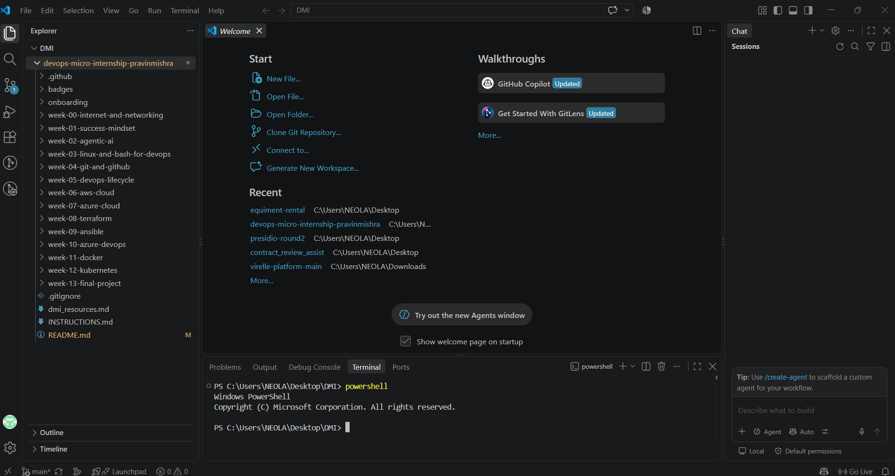

# Week 00 - Internet and Networking

Part of the DevOps Micro Internship (DMI) Cohort 3 with Agentic AI

---

# 🧑‍💻 Task 1: Using ChatGPT as Your Learning Assistant

## Scenario

You're new to DevOps and will frequently encounter technical questions. ChatGPT can be your learning companion.

## Your Task

Write a clear ChatGPT prompt to help you understand:

> "What is a protocol in networking? Explain with a simple real-life example."

Take a screenshot of your interaction showing:

* Your detailed prompt (with clear expectations)
* ChatGPT's simplified response with an example

## Screenshot

Save your screenshot in the `screenshots` folder and update the file name below.



Replace `task-1-chatgpt.png` with your actual screenshot file name.

---

## What I Learned (2–3 lines)

I learned that a networking protocol is a set of rules that devices follow to communicate with each other. For example, just like people follow rules while having a conversation, computers use protocols such as HTTP and TCP to exchange information correctly.

---

# 🌐 Task 2: Internet and Networking

## Scenario

Your friend is launching an online bookstore named **EpicReads**.

He asked you to explain how users globally can access his website hosted in Finland.

## Your Task

Write a short explanation (**100–150 words**) that includes:

* Packet Switching
* IP Address
* TCP/IP
* HTTP/HTTPS

💡 **Tip:** You may use ChatGPT (as demonstrated in Task 1) to refine your explanation.

## Answer

When a user opens the EpicReads website, the request is sent across the Internet using **packet switching**, where the data is divided into smaller packets and sent through different network paths. The server hosting EpicReads in Finland has a unique **IP address**, which helps identify and locate the server on the Internet. **TCP/IP** provides the basic communication rules that allow the user's device and the server to exchange data reliably. TCP ensures that packets are delivered correctly and in the proper order, while IP handles addressing and routing. Once the request reaches the server, **HTTP or HTTPS** is used to transfer web pages and other resources between the browser and server. HTTPS is preferred because it encrypts the communication and protects user information.

---

# 🏗️ Task 3: Application Architecture & Stack

## Scenario

EpicReads bookstore has two application versions:

### Two-Tier Application

* Frontend
* Database

### Three-Tier Application

* Frontend
* Backend
* Database

## Your Task

* Draw simple diagrams (hand-drawn or tool-based such as draw.io)
* Label each layer clearly
* List at least two common technologies or tools used for each layer
* Submit a screenshot or photo clearly showing your own drawing

## Diagram Screenshot / Photo

Save your diagram image in the `screenshots` folder and update the file name below.



Replace `task-3-diagram.png` with your actual diagram file name.

---

## Technologies Used

### Frontend

* React
* HTML/CSS/JavaScript

### Backend

* Node.js
* Express.js

### Database

* MySQL
* MongoDB

---

# 🌍 Task 4: Domain Name & DNS (Basic Concepts)

## Scenario

Your friend's bookstore **EpicReads** is currently accessible through:

```text
52.172.142.222:3000
```

He purchased the domain:

```text
epicreads.com
```

## Your Task

In **50–100 words**, explain in your own words:

1. What is DNS (Domain Name System)?
2. Which DNS record type should be used to connect the domain to the given IP, and why?

## Answer

DNS (Domain Name System) translates human-readable domain names such as `epicreads.com` into IP addresses that computers can use to locate servers. To connect `epicreads.com` to `52.172.142.222`, an **A record** should be created because an A record maps a domain name to an IPv4 address. The port `3000` is not included in the DNS A record; DNS only maps the domain to the server's IP address. The application can then be accessed using the appropriate port.

---

# 💻 Task 5: Visual Studio Code Setup (Hands-on)

## Your Task

Install Visual Studio Code (if not already installed).

Take a screenshot of your VS Code environment showing:

* Terminal open inside VS Code
* Running a basic command:

### Windows

```powershell
dir
```

### Linux / macOS

```bash
pwd
ls
```

* Your selected VS Code theme clearly visible

⚠️ **Important:** The screenshot must show your username or another identifiable detail to confirm it is your environment.

## Screenshot

Save your screenshot in the `screenshots` folder and update the file name below.



Replace `task-5-vscode.png` with your actual screenshot file name.

---

# 🔗 Task 6: Publish Your Assignment as a LinkedIn Post

## Objective

Publishing on LinkedIn helps you:

* Build your professional online presence
* Reinforce your learning
* Document your DevOps journey publicly

## Your Task

Summarize your answers from Tasks 1–5 into a LinkedIn post.

Clearly structure your post into the following sections:

* ChatGPT
* Internet & Networking
* App Architecture
* DNS
* VS Code Setup

Use the credit note that matches your track:

Add the following credit note at the end of your post **(If you are DMI Cohort 3 student)**:

> **P.S. This post is part of the DevOps Micro Internship (DMI) with Agentic AI — Cohort 3 — by Pravin Mishra. My graded progress is public: https://dmi.pravinmishra.com/s/YOUR-GITHUB-USERNAME.html · Start your DevOps journey: https://dmi.pravinmishra.com/?utm_source=student&utm_medium=ps-linkedin&utm_campaign=cohort3**

Add the following credit note at the end of your post **(If you are DMI Self-paced track student)**:

> **P.S. This post is part of the DevOps Micro Internship (DMI) — Self-Paced Engineer Track — by Pravin Mishra. My graded progress is public: https://dmi.pravinmishra.com/s/YOUR-GITHUB-USERNAME.html · Start your DevOps journey: https://dmi.pravinmishra.com/?utm_source=student&utm_medium=ps-linkedin&utm_campaign=self-paced**

Add the following credit note at the end of your post **(If you are DMI Campus student)**:

> **P.S. This post is part of the DevOps Micro Internship (DMI) — Campus — by Pravin Mishra. My graded progress is public: https://dmi.pravinmishra.com/s/YOUR-GITHUB-USERNAME.html · Start your DevOps journey: https://dmi.pravinmishra.com/?utm_source=student&utm_medium=ps-linkedin&utm_campaign=campus**

## Replace `YOUR-GITHUB-USERNAME` with your GitHub username — that link is your public DMI progress page (your graded badge page).

## LinkedIn Post URL

Paste your LinkedIn post URL here:
https://lnkd.in/p/gGwKwkxn

---

## LinkedIn Post Backup Copy
🚀 Week 0 | DevOps Micro Internship (DMI) – Cohort 3
I’m excited to begin my DevOps learning journey through the DevOps Micro Internship (DMI) – Cohort 3 with Agentic AI by Pravin Mishra.
This week focused on building a strong foundation in Internet, Networking, and basic application architecture.
💬 ChatGPT as a Learning Assistant
I explored how ChatGPT can be used as a learning companion to simplify technical concepts. I learned that networking protocols are a set of rules that enable devices to communicate correctly, similar to how people follow rules while communicating.
🌐 Internet & Networking
I learned the basics of:
• Packet Switching
• IP Addresses
• TCP/IP
• HTTP & HTTPS
I also understood how a user's request can travel across the Internet to reach a website hosted on a server in another country.
🏗️ Application Architecture
I explored the difference between two-tier and three-tier architectures.
A three-tier application separates:
Frontend → Backend → Database
I also explored technologies such as React, Node.js, Express.js, MySQL, and MongoDB.
🌍 DNS
I learned how DNS (Domain Name System) translates human-readable domain names into IP addresses.
For example, an A record can map a domain such as epicreads.com to an IPv4 address.
💻 VS Code Setup
I also set up and explored my VS Code development environment, including using the integrated terminal and basic commands.
📚 Key Takeaway
This week helped me understand the fundamentals behind how applications communicate over the Internet and how different components of a web application work together.
Looking forward to building more hands-on skills in Linux, Git, networking, cloud, and DevOps tools in the upcoming weeks. 🚀
P.S. This post is part of the DevOps Micro Internship (DMI) with Agentic AI — Cohort 3 — by Pravin Mishra.
My graded progress is public:
https://lnkd.in/g77hyQiW
Start your DevOps journey:
https://lnkd.in/gyMdepv8
#DevOps #DevOpsJourney #DMI #DevOpsMicroInternship #AgenticAI #Networking #Linux #Git #Cloud #LearningInPublic #TechJourney

# Reflection – Week 0

### What did you find easy?

Understanding basic networking concepts such as IP addresses, DNS, HTTP/HTTPS, and application architecture was relatively easy because I could relate them to real-world examples.

---

### What was difficult?

Understanding how different networking concepts work together, especially packet switching, TCP/IP, and DNS, was initially challenging. Creating the application architecture diagram also required understanding the responsibilities of each layer.

---

### What will you improve next week?

Next week, I will improve my understanding of DevOps fundamentals by getting more hands-on with Linux commands, networking, Git, and other tools used in real-world DevOps workflows.

---

## 📌 About DMI & CloudAdvisory

DevOps Micro Internship (DMI) is a project-based DevOps program run by Pravin Mishra (The CloudAdvisory) focused on real-world execution, systems thinking, and career readiness.

It helps learners build strong DevOps foundations with hands-on experience.

## 📌 Resources

* 🌐 **DMI Official Website:** https://dmi.pravinmishra.com?utm_source=github&utm_medium=readme
* 🎓 **University:** https://university.pravinmishra.com?utm_source=github&utm_medium=readme
* 💬 **Discord Community:** https://discord.pravinmishra.com?utm_source=github&utm_medium=readme
* 📝 **Blog:** https://dmi.pravinmishra.com/blog?utm_source=github&utm_medium=readme
* ▶️ **YouTube Playlist (DMI Cohort 3):** https://www.youtube.com/playlist?list=PLFeSNDtI4Cho
* 🔗 **Pravin Mishra (LinkedIn):** https://www.linkedin.com/in/pravin-mishra-aws-trainer/
* 🏢 **CloudAdvisory (LinkedIn):** https://www.linkedin.com/company/thecloudadvisory/

---

*This submission is part of DevOps Micro Internship (DMI) Cohort 3 — Agentic AI Track*
